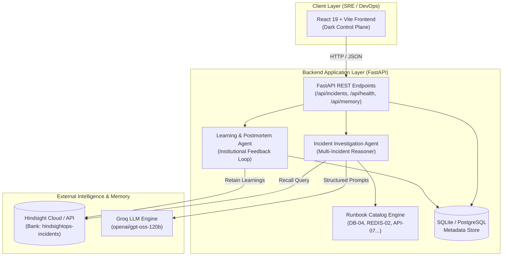
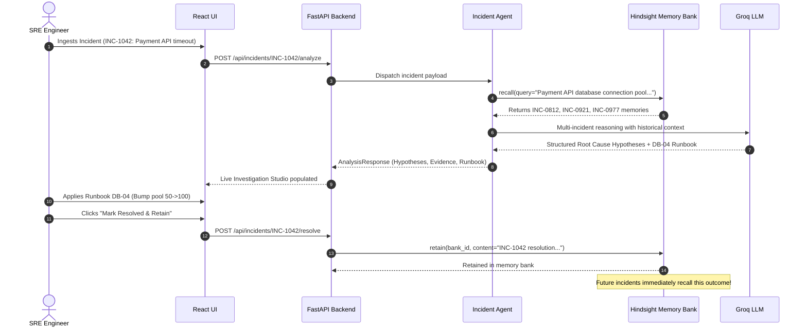

# HindsightOps System Architecture

This document describes the architectural design of **HindsightOps**, explaining how persistent long-term memory via Hindsight powers an intelligent production incident response agent.

---

## 🏛️ High-Level System Architecture

---

## 🔄 The Incident Learning Lifecycle

---

## 🧩 Architectural Components

### 1. Frontend (`/frontend`)
- **Technology:** React 19, Vite, Tailwind CSS, Lucide Icons.
- **Aesthetic:** Dark-first, serious SRE cockpit designed for high telemetry density.
- **Key Modules:**
  - `IncidentDetail`: Real-time investigation studio with split telemetry/AI pane.
  - `MemoryExplorer`: Inspection tool for stored memory units and live query tester.
  - `MemoryLearningDemo`: 10-step interactive presentation flow for hackathon judges.
  - `BeforeAfterComparison`: Head-to-head evaluation matrix.

### 2. Backend (`/backend/app`)
- **Framework:** FastAPI with Python 3.11 asynchronous handlers.
- **Data Models:** SQLAlchemy ORM models (`Incident`, `Postmortem`, `MemoryRecallLog`).
- **Configuration:** `pydantic-settings` reading `.env` with strict zero-secret exposure.

### 3. Agent Architecture (`/backend/app/agents`)
- **`IncidentAgent`:**
  - Parses raw incident symptoms and error strings.
  - Formulates multi-vector queries for Hindsight memory recall.
  - Matches symptoms against curated runbooks (`find_matching_runbooks`).
  - Calls Groq with structured JSON schemas (`MEMORY_AUGMENTED_PROMPT_TEMPLATE`).
  - Assembles observable facts, hypotheses, and verifiable evidence.
- **`LearningAgent`:**
  - Ingests actual engineering resolution, recovery time, and feedback score.
  - Generates blameless postmortems (`PostmortemCreate`).
  - Formats postmortem into long-term knowledge units (`format_postmortem_for_hindsight`).
  - Retains memories directly into the Hindsight memory bank.

### 4. Memory Integration (`/backend/app/hindsight`)
- Uses the official `hindsight-client` Python SDK.
- Configurable base URL: `https://api.hindsight.vectorize.io` (Hindsight Cloud) or `http://localhost:8888` (self-hosted).
- Namespace isolation via `bank_id` (`hindsightops-incidents`).
- Transparent offline demo fallback if credentials are absent, guaranteeing zero crashes.
