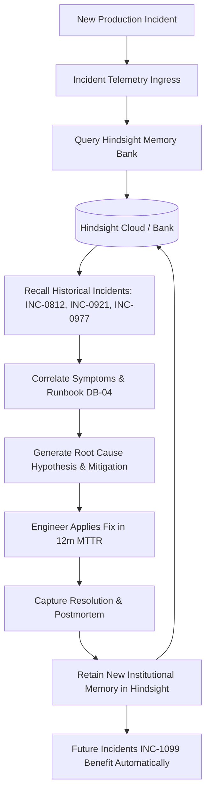

# HindsightOps ⚡
### AI Incident Response Agent That Remembers What Happened Before

[](https://hackwithhyderabad.com)
[](https://hindsight.vectorize.io/)
[](https://vite.dev)
[](https://fastapi.tiangolo.com)
[](LICENSE)

> **Tagline:** *"An AI incident responder that remembers what happened before."*

---

## 📌 Problem & Hackathon Vision

When production outages occur, engineering teams waste precious hours re-diagnosing identical failure modes. Institutional knowledge is scattered across disparate Slack threads, closed Jira tickets, and forgotten postmortems.

Generic AI assistants provide textbook guesswork (e.g. *"Restart the database"*), which can cause catastrophic cascading failovers in production.

**HindsightOps** transforms production incident response by introducing **persistent long-term memory via Hindsight**. The agent behaves like a Staff SRE who has seen hundreds of previous outages:
1. **Remembers** past incidents, logs, error signatures, and root causes.
2. **Recalls** relevant historical incidents and proven runbooks during new outages.
3. **Learns** from engineer feedback and postmortems.
4. **Improves** recommendations continuously over time.

---

## 🧠 How Hindsight Powers HindsightOps

Hindsight is the foundational memory layer of HindsightOps. It stores structured institutional memory and retrieves relevant context across session boundaries:



### The 7-Step Hindsight Memory Lifecycle:
1. **Ingress:** A new production outage occurs (e.g. Payment API connection pool timeout `INC-1042`).
2. **Recall:** The agent executes a semantic recall against Hindsight memory bank `hindsightops-incidents`.
3. **Historical Evidence:** Hindsight surfaces 3 previous incidents (`INC-0812`, `INC-0921`, `INC-0977`) and matched runbook `DB-04`.
4. **Structured Reasoning:** The agent formulates high-confidence root cause hypotheses with observable facts and verifiable prior resolutions.
5. **Mitigation:** SRE applies the historically proven fix (scale pool size 50 → 100).
6. **Postmortem Retention:** Engineer verifies recovery and clicks **"Save Learning to Hindsight"**, storing root cause findings into long-term memory.
7. **Future Resilience:** When a future incident (`INC-1099`) occurs, the agent immediately cites both historical knowledge AND the newly retained `INC-1042` postmortem!

---

## ⚖️ Core Differentiator: Stateless AI vs HindsightOps

| Dimension | Stateless AI (Zero Memory) | HindsightOps (Hindsight Memory) |
|---|---|---|
| **Context** | Isolated error message only | Persistent institutional memory across years |
| **Suggestion** | Dangerous: *"Restart database master"* | Targeted: *"Follow Runbook DB-04 step 1 to bump pool"* |
| **Runbook Grounding** | None | Matches team runbooks (DB-04, REDIS-02, API-07) |
| **MTTR Recovery** | 35–45 minutes trial-and-error | 10–12 minutes based on proven historical precedent |
| **Institutional Retention** | Forgotten immediately | Retained in Hindsight for future engineers |

---

## 🚀 Key Features

- **Executive Engineering Dashboard:** Real-time visibility into active outages, memory retention stats, and MTTR trends.
- **Incident Investigation Studio:** Split-pane interface separating observed telemetry from AI hypotheses and historical evidence.
- **Similar Incidents Engine:** Transparent card view of recalled historical incidents with similarity scores and recovery times.
- **Hindsight Memory Explorer:** Interactive inspection of stored memory units, tags, and a live semantic memory query tester.
- **Curated Runbook Catalog:** Integrated runbooks (DB-04, REDIS-02, API-07, K8S-03, DEP-05, SEC-01) with 1-click command copying.
- **Postmortem Generator:** Blameless postmortem generator with direct **"Save Learning to Hindsight"** retention CTA.
- **60-Second Judge Demo Mode:** 10-step guided walkthrough illustrating the entire before/after memory learning loop.
- **Before vs After Comparison Matrix:** Direct comparative view built specifically for hackathon evaluation.
- **Graceful Demo Fallback:** Built-in local vector fallback ensuring 100% functionality even when offline or before API keys are entered.

---

## 🛠️ Technology Stack

- **Frontend:** React 19, Vite, Tailwind CSS, Lucide Icons
- **Backend:** Python 3.11, FastAPI, SQLAlchemy, Pydantic v2
- **Memory Engine:** Hindsight Cloud / `hindsight-client` Python SDK
- **LLM Engine:** Groq Cloud (`openai/gpt-oss-120b`, `qwen/qwen3-32b`)
- **Database:** SQLite (PostgreSQL ready)
- **Testing:** Pytest, FastAPI TestClient

---

## ⚡ Quick Start

### 1. Clone & Setup Environment
```bash
git clone https://github.com/your-org/hindsightops.git
cd hindsightops
cp .env.example .env
```

### 2. Configure Credentials in `.env` (Optional for Demo Mode)
```bash
GROQ_API_KEY=your_groq_api_key_here
HINDSIGHT_API_KEY=your_hindsight_api_key_here
HINDSIGHT_BASE_URL=https://api.hindsight.vectorize.io
HINDSIGHT_BANK_ID=hindsightops-incidents
```
> *Note: If keys are left empty, HindsightOps automatically runs in high-fidelity **Demo Mode** with transparent labeling!*

### 3. Start Backend
```bash
# Install backend requirements
pip install -r backend/requirements.txt

# Seed historical incidents into Hindsight & database
python backend/seed_memory.py

# Start FastAPI server (Port 8000)
uvicorn app.main:app --app-dir backend --reload --port 8000
```

### 4. Start Frontend
```bash
cd frontend
npm install
npm run dev
```
Open **[http://localhost:5173](http://localhost:5173)** in your browser!

---

## 🧪 Automated Tests

Run the backend test suite:
```bash
python -m pytest backend/test_suite.py -v
```

---

## 🏆 Hackathon Judging Criteria Alignment

- **Innovation (30%):** Replaces static runbook wikis and stateless LLM wrappers with an active memory-guided investigation agent.
- **Hindsight Memory (25%):** Hindsight is the central nervous system; all reasoning is grounded in memory recall and postmortem retention.
- **Technical Implementation (20%):** Full-stack architecture with FastAPI, React, SQLAlchemy, and official `hindsight-client` SDK.
- **User Experience (15%):** Modern dark-first SRE control plane with high telemetry density, timeline tracking, and zero clutter.
- **Real-World Impact (10%):** Directly slashes MTTR during mission-critical production outages.
